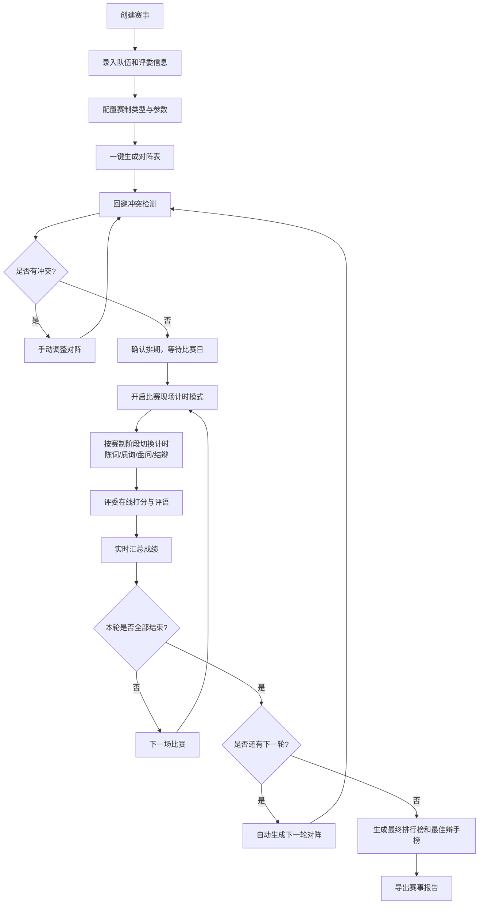

## 1. 产品概述
专业级线上辩论计时与赛制编排系统，为议会制辩论、华语辩论、模拟法庭等辩论赛提供全流程数字化解决方案。面向赛事主办方、评委、辩手，解决赛制编排繁琐、计时不精准、成绩统计复杂等痛点。

- 主要目的：实现辩论赛从报名、编排、计时、打分到结果公布的全流程线上化、自动化
- 目标用户：高校辩论社、专业赛事主办方、模拟法庭组委会、各级辩论赛承办方
- 市场价值：填补国内专业级辩论赛事管理系统空白，提升辩论赛组织效率50%以上

## 2. 核心功能

### 2.1 用户角色
| 角色 | 注册方式 | 核心权限 |
|------|----------|----------|
| 赛事管理员 | 系统创建 | 创建赛事、管理队伍/评委/辩题、编排赛制、推进赛程、查看所有数据 |
| 评委 | 邀请链接 | 查看分配的比赛、在线打分、录入评语、提交成绩 |
| 辩手/观众 | 无需登录 | 查看赛程、观看计时、查看排行榜和结果 |

### 2.2 功能模块
1. **赛事仪表盘**：赛事总览、快速入口、赛程状态、数据统计
2. **队伍管理**：参赛队伍创建/编辑/导入、选手信息、学校/机构关联
3. **评委管理**：评委信息录入、回避关系设置、评分偏好配置
4. **辩题库管理**：辩题分类存储、难度标签、按赛制/轮次自动分配
5. **赛制编排**：支持单败淘汰/瑞士轮/循环赛、自动生成对阵表、回避检测
6. **比赛现场**：多赛制分阶段计时器、实时计时状态展示、阶段切换控制
7. **评委打分**：在线评分表单、评分维度配置、评语录入、成绩实时汇总
8. **成绩排行榜**：实时排名更新、最佳辩手榜、队伍积分榜、导出报告

### 2.3 页面详情
| 页面名称 | 模块名称 | 功能描述 |
|----------|----------|----------|
| 仪表盘 | 赛事概览卡片 | 显示赛事名称、赛制类型、参赛队伍数、评委数、比赛进度 |
| 仪表盘 | 快捷操作区 | 创建比赛、导入队伍、生成对阵表、进入下一轮 |
| 仪表盘 | 今日赛程 | 当天比赛列表及状态（未开始/进行中/已结束） |
| 队伍管理 | 队伍列表 | 表格展示队伍信息、学校、选手、操作按钮 |
| 队伍管理 | 新增/编辑队伍 | 表单录入队伍名称、学校、选手（姓名+身份+联系方式） |
| 队伍管理 | 批量导入 | 支持Excel模板批量导入队伍和选手 |
| 评委管理 | 评委列表 | 展示评委信息、所属机构、回避关系数量 |
| 评委管理 | 回避配置 | 设置评委需回避的学校/队伍/选手 |
| 辩题库 | 辩题列表 | 按分类/赛制筛选、关键词搜索 |
| 辩题库 | 新增辩题 | 录入题目、正反方、分类标签、适用赛制、难度 |
| 赛制编排 | 赛制配置 | 选择赛制类型（单败/瑞士/循环）、轮次、每场比赛评委数 |
| 赛制编排 | 对阵生成器 | 一键生成对阵表、显示配对合理性、回避冲突提示 |
| 赛制编排 | 对阵表视图 | 树形结构（淘汰赛）或表格视图展示全部对阵 |
| 比赛现场 | 大计时器 | 中央大号倒计时显示、当前阶段名称、剩余时间进度环 |
| 比赛现场 | 对阵信息 | 展示双方队伍名称、辩题、立场、评委列表 |
| 比赛现场 | 阶段控制 | 陈词/质询/盘问/结辩阶段切换按钮、暂停/继续/重置 |
| 评委打分 | 评分面板 | 按选手分维度评分条、维度权重配置、实时分数预览 |
| 评委打分 | 评语录入 | 富文本评语输入、快捷评语模板、语音转文字入口 |
| 排行榜 | 队伍排名 | 积分榜、胜率榜、辩手个人得分榜 |
| 排行榜 | 最佳辩手 | 累计得分、单场MVP次数、平均分排名 |
| 排行榜 | 赛事报告 | 可视化统计图表、导出PDF/Excel报告 |

## 3. 核心流程
赛事管理员创建赛事后，录入参赛队伍与评委信息，配置赛制参数，系统自动生成对阵表并进行回避检测，确认后比赛进入排期。比赛日开启计时模式，按照赛制分阶段倒计时，各阶段结束自动提醒。评委在打分面板按维度评分并提交评语，系统实时汇总所有评委打分，计算平均分与排名。一轮比赛全部结束后，管理员可一键生成下一轮对阵，直至赛事结束生成最终排行榜和最佳辩手榜单。

## 4. 用户界面设计

### 4.1 设计风格
- **主色调**：深邃海军蓝 `#0F2944` 为主色，搭配金色 `#D4A574` 作为点缀色，彰显专业与权威感
- **辅助色**：象牙白 `#F8F6F1` 背景，冷灰 `#6B7280` 文字，绿色 `#10B981` 表示正方/进行中，红色 `#EF4444` 表示反方/结束
- **按钮样式**：圆角8px，主按钮带微渐变+投影，悬停时有上浮动效
- **字体**：标题使用 "Noto Serif SC" 衬线字体，正文使用 "Inter" 无衬线字体，数字使用 "Roboto Mono" 等宽字体
- **布局风格**：顶部导航栏+左侧侧边栏双栏布局，内容区卡片式设计，大量留白
- **图标风格**：统一使用 Lucide 线性图标，16px/20px 为主

### 4.2 页面设计概述
| 页面名称 | 模块名称 | UI 元素 |
|----------|----------|----------|
| 仪表盘 | 赛事概览 | 4张渐变卡片并列展示关键指标，卡片带hover上升动画和数据微动效 |
| 仪表盘 | 今日赛程 | 时间线样式展示比赛，当前进行中的卡片高亮+脉冲动效 |
| 比赛现场 | 大计时器 | 居中600px超大圆形进度环，内部显示倒计时数字，阶段切换时环形颜色渐变过渡 |
| 比赛现场 | 对阵栏 | 左右对称布局，正方绿色标识，反方红色标识，中间金色辩题分隔 |
| 评委打分 | 评分条 | 横向拖动滑块评分，下方显示维度说明，右侧实时分数气泡 |
| 排行榜 | 排名列表 | 前三名使用金色/银色/铜色渐变背景，排名变化带箭头微动效 |
| 赛制编排 | 对阵树 | 淘汰赛使用树形Bracket图，连线带动画从左到右展示晋级路径 |

### 4.3 响应式
- Desktop-first 设计，主内容区最小宽度1280px
- 平板端（1024px）：左侧边栏可折叠为图标栏
- 移动端：顶部导航+卡片流布局，大计时器自适应屏幕宽度
- 计时器页面支持全屏模式，按F键切换全屏显示
- 所有表格支持横向滚动，关键列固定

### 4.4 动效细节
- 页面加载：顶部导航先出现，内容区卡片从下至上渐入，stagger延迟50ms
- 倒计时：每秒数字有轻微缩放脉冲，最后10秒数字变红并加速脉冲
- 阶段切换：圆形进度环有平滑的颜色渐变过渡动画（800ms ease-in-out）
- 打分提交：提交按钮有loading状态旋转，完成后出现对勾✓动效
- 对阵生成：对阵卡片依次淡入，带随机轻微旋转和归位动效
