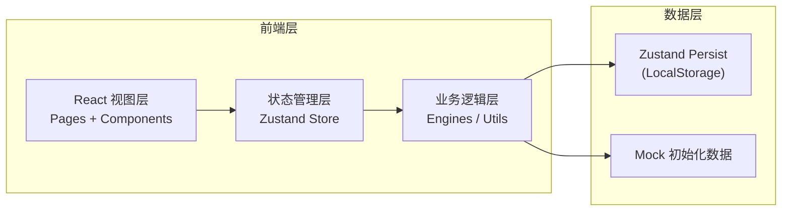
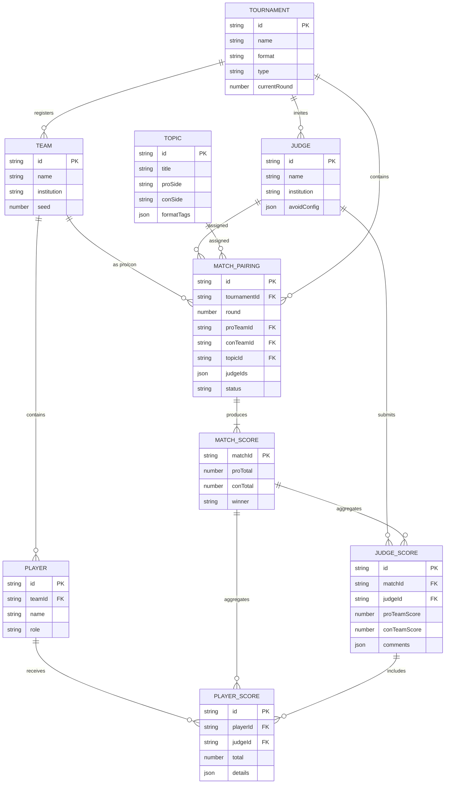

## 1. 架构设计
纯前端单页应用，使用 LocalStorage + IndexedDB 存储数据，无需后端服务即可运行，支持后续扩展接入后端API。



## 2. 技术描述
- **前端框架**：React@18 + TypeScript
- **构建工具**：Vite@5
- **样式方案**：TailwindCSS@3 + CSS Variables
- **路由管理**：React Router DOM@6
- **状态管理**：Zustand@4 + persist 中间件
- **图标库**：Lucide React
- **UI交互**：原生CSS动画 + React hooks
- **数据存储**：LocalStorage（持久化状态）+ Mock 数据初始化
- **图表可视化**：Recharts（成绩排行榜图表）

## 3. 路由定义
| 路由路径 | 页面组件 | 用途 |
|----------|----------|------|
| `/` | Dashboard | 赛事仪表盘总览 |
| `/teams` | TeamsPage | 队伍管理（增删改查、批量导入） |
| `/judges` | JudgesPage | 评委管理与回避配置 |
| `/topics` | TopicsPage | 辩题库管理 |
| `/tournament` | TournamentPage | 赛制编排与对阵表生成 |
| `/live/:matchId` | LiveMatchPage | 比赛现场计时与打分 |
| `/judge/:matchId` | JudgeScoringPage | 评委独立打分面板 |
| `/ranking` | RankingPage | 排行榜与最佳辩手榜 |

## 4. API 定义（无后端，采用 TypeScript 类型约定）
```typescript
// ============ 核心实体类型 ============
interface Team {
  id: string;
  name: string;
  institution: string;       // 所属学校/机构
  players: Player[];          // 成员选手
  seed: number;               // 种子排位（用于编排）
  createdAt: number;
}

interface Player {
  id: string;
  name: string;
  role: '一辩' | '二辩' | '三辩' | '四辩' | '替补';
  contact?: string;
  scores: PlayerScoreRecord[]; // 个人评分历史
}

interface Judge {
  id: string;
  name: string;
  institution: string;
  title?: string;
  avoidTeams: string[];       // 需回避的队伍ID
  avoidInstitutions: string[]; // 需回避的机构名
  avoidPlayers: string[];     // 需回避的选手ID
}

interface Topic {
  id: string;
  title: string;
  proSide: string;            // 正方立场描述
  conSide: string;            // 反方立场描述
  category: ('政策' | '价值' | '事实' | '模拟法庭')[];
  formats: DebateFormat[];    // 适用赛制
  difficulty: 1 | 2 | 3 | 4 | 5;
}

// ============ 赛制相关类型 ============
type DebateFormat = 'parliamentary' | 'mandarin' | 'moot_court' | 'british_parliamentary';
type TournamentType = 'single_elimination' | 'swiss' | 'round_robin';

interface DebateStageConfig {
  name: string;               // 阶段名称，如"正方一辩陈词"
  side?: 'pro' | 'con' | 'both' | 'judge';
  speaker?: number;           // 对应辩位
  duration: number;           // 秒数
  crossExamine?: {            // 质询配置
    enabled: boolean;
    duration?: number;
  };
}

interface FormatRules {
  format: DebateFormat;
  label: string;
  stages: DebateStageConfig[]; // 比赛阶段与时长
  scoringCriteria: ScoringCriterion[];
}

interface ScoringCriterion {
  id: string;
  name: string;               // 评分维度，如"立论深度"
  maxScore: number;           // 满分
  weight: number;             // 权重
}

// ============ 比赛与对阵 ============
interface TournamentConfig {
  id: string;
  name: string;
  format: DebateFormat;
  type: TournamentType;
  totalRounds: number;
  judgesPerMatch: number;
  createdAt: number;
  currentRound: number;
}

interface MatchPairing {
  round: number;              // 第几轮
  matchNumber: number;        // 本轮第几场
  proTeamId: string;
  conTeamId: string;
  topicId: string;
  judgeIds: string[];
  status: 'pending' | 'ongoing' | 'finished';
  scores?: MatchScore;
  winner?: 'pro' | 'con' | 'draw';
}

interface MatchScore {
  matchId: string;
  judgeScores: JudgeScore[];  // 每位评委的评分
  proTeamTotal: number;       // 正方总分（取所有评委平均）
  conTeamTotal: number;
  playerScores: PlayerMatchScore[];
}

interface JudgeScore {
  judgeId: string;
  proTeamScore: number;       // 正方团队分
  conTeamScore: number;       // 反方团队分
  proPlayerScores: Record<string, PlayerScore>; // {playerId: score}
  conPlayerScores: Record<string, PlayerScore>;
  comments: {
    pro?: string;
    con?: string;
    general?: string;
  };
  submittedAt: number;
}

interface PlayerScore {
  criteriaScores: Record<string, number>; // {criterionId: score}
  total: number;
}

interface PlayerScoreRecord {
  matchId: string;
  score: number;
  isMVP: boolean;
}

// ============ 排名相关 ============
interface TeamRanking {
  teamId: string;
  teamName: string;
  institution: string;
  wins: number;
  losses: number;
  draws: number;
  winRate: number;
  totalScore: number;
  avgScore: number;
  ballots: number;            // 获票数
}

interface PlayerRanking {
  playerId: string;
  playerName: string;
  teamName: string;
  totalMatches: number;
  totalScore: number;
  avgScore: number;
  mvpCount: number;
}
```

## 5. 数据模型 ER 图


## 6. 核心引擎模块说明

### 6.1 赛制编排引擎 (`src/engines/tournamentEngine.ts`)
- `generateSingleElimination(teams: Team[])`: 生成单败淘汰赛对阵树，支持种子排位
- `generateSwissRound(teams: Team[], round: number, history: MatchPairing[])`: 瑞士轮配队，按积分高低配对，避免重复对阵
- `generateRoundRobin(teams: Team[])`: 循环赛轮转法生成每轮对阵
- `checkAvoidanceConflicts(pairing: MatchPairing, judges: Judge[])`: 检测评委与对阵队伍的回避冲突
- `assignTopicsToMatches(matches: MatchPairing[], topics: Topic[], format: DebateFormat)`: 按适用赛制分配辩题，避免重复

### 6.2 计时引擎 (`src/engines/timerEngine.ts`)
- `createTimerState(formatRules: FormatRules)`: 初始化计时状态机
- `nextStage(current: TimerState)`: 推进到下一阶段
- `prevStage(current: TimerState)`: 返回上一阶段
- `tick(state: TimerState, deltaMs: number)`: 时钟tick更新剩余时间
- `getTimeDisplay(seconds: number)`: 格式化 `mm:ss` 显示

### 6.3 评分引擎 (`src/engines/scoringEngine.ts`)
- `calculatePlayerTotal(playerScore: PlayerScore, criteria: ScoringCriterion[])`: 计算选手加权总分
- `calculateMatchResult(judgeScores: JudgeScore[])`: 汇总所有评委分数，判定胜负
- `calculateTeamRankings(matches: MatchPairing[], teams: Team[])`: 计算队伍积分榜
- `calculatePlayerRankings(matches: MatchPairing[], players: Player[])`: 计算辩手个人榜
- `calculateMVP(match: MatchPairing, score: MatchScore)`: 单场最佳辩手判定
